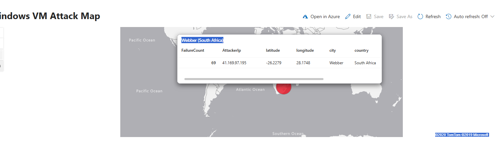

# Azure-SOC-SIEM-Analyzing-and-Monitoring-Attack-Data-using-a-Honey-Pot
Part 1. Setup Azure Subscription
- Create a free Azure subscription: Azure Free Account
- If a free account isn’t available:
- Use a paid subscription (remember to shut down/delete resources when done), or
- Join the Cyber Range: Cyber Range
Login to the Azure Portal: https://portal.azure.com

Part 2. Create the Honey Pot (Azure Virtual Machine)
- In the Azure Portal, search for Virtual Machines.
- Create a Windows 10 VM (choose size based on subscription).
- ⚠️ Leaving a VM running 24/7 can be costly. Shut it down when not in use.
- Configure the Network Security Group (NSG):
- Add a rule to allow all inbound traffic.
- Log into the VM and disable the Windows Firewall:
- Run wf.msc → Properties → Turn Off all profiles.

Part 3. Logging into the VM and Inspecting Logs
- Attempt 3 failed logins as user employee (or another username).
- Successfully log in with your credentials.
- Open Event Viewer → Security Logs.
- Look for Event ID 4625 (failed login attempts).
Next, we’ll centralize logs in a Log Analytics Workspace (LAW).

Part 4. Log Forwarding and KQL
- Create a Log Analytics Workspace (LAW).
- Deploy Microsoft Sentinel and connect it to LAW.
- Configure the Windows Security Events via AMA connector.
- Create a Data Collection Rule (DCR) in Sentinel.
- Query logs in LAW using KQL (Kusto Query Language):
SecurityEvent
| where EventId == 4625

💡 KQL is essential for SOC analysts. If you know SQL or SPL, you can easily adapt to KQL.

Part 5. Log Enrichment and Finding Location Data
By default, logs only show IP addresses. We’ll enrich them with geolocation data.
- Download the GeoIP dataset:
geoip-summarized.csv
- In Sentinel, create a Watchlist:
- Name/Alias: geoip
- Source type: Local File
- Search Key: network
- Import ~54,000 rows.
- Run a query to enrich logs with location data:
let GeoIPDB_FULL = _GetWatchlist("geoip");
let WindowsEvents = SecurityEvent
    | where EventID == 4625
    | order by TimeGenerated desc
    | evaluate ipv4_lookup(GeoIPDB_FULL, IpAddress, network);
WindowsEvents

Now, failed login attempts will include geographic information 🌍.

Part 6. Attack Map Creation
- In Sentinel, create a new Workbook.
- Delete pre-populated elements → Add a Query element.
- Open the Advanced Editor and paste the JSON from map.json.
- Configure query + map settings.
- Observe a live attack map of failed login attempts.

✅ Finished!
You now have:
- A honeypot VM in Azure
- Centralized log collection in Sentinel
- Enriched logs with geolocation data
- A real-time attack map visualization

- A thank you to Josh Madakor and Cyber Range for the project.
